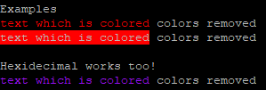

# Color and Gradient Usage
> If you're sick of the typical way of adding color i.e `\x1b[30m` type colors then you're in luck.
you can add colors anyway you want be it the background or foreground.
There are plenty of existing gradients and colors to pick from, but if you can't find you like then you can always make your own in `colors.json`!
> 
> ## Examples
> \<red\>text which is colored</> colors removed\
> \<*red\>text which is colored</> colors removed
> #### Hexidecimal works too!
> <#970FF8>text which is colored</> colors removed
> 
> #### Actual output
> 